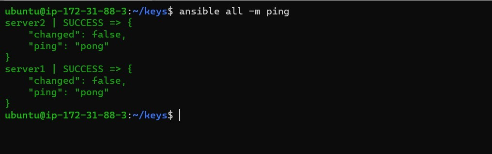
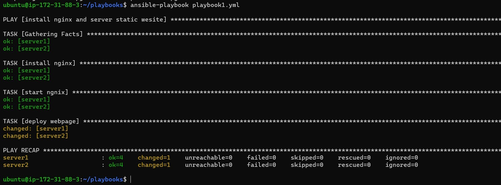

<table>
    <tbody>
        <tr>
            <td colspan="2">
                <h4>
                    Universidad de San Carlos de Guatemala
                </h4>
                <h4>
                    Facultad de Ingeniería
                </h4>
                <h4>
                    Ingeniería en Ciencias y Sistemas
                </h4>
                <h4>
                    Software Avanzado - B
                </h4>
            </td>
        </tr>
        <tr>
            <td>
                <h4>
                    201212535
                </h4>
            </td>
            <td>
                <h4>
                    Mike Leonel Molina García
                </h4>
            </td>
        </tr>
    </tbody>
</table>

---
> ## DOCUMENTACIÓN

## \\> Instalación de Terraform
---
### Ubuntu
Para realizar la instalación en nuestra distribución de ubuntu necesitamos ejecutar los comandos que se describen a continuación:
1.  Actualizamos nuestros repositorios e instalamos las dependencias necesarias para proceder con la instalación de terraform.
    *   ```plaintext
        $ sudo apt-get update && sudo apt-get install -y gnupg software-properties-common
        ```
        
2.  Instalamos las credenciales de Hashicorp
    *   ```plaintext
        $ wget -O- https://apt.releases.hashicorp.com/gpg | \
        gpg --dearmor | \
        sudo tee /usr/share/keyrings/hashicorp-archive-keyring.gpg
        ```
        
3.  Verificamos las fingerprints de las keys
    *   ```plaintext
        $ gpg --no-default-keyring \
        --keyring /usr/share/keyrings/hashicorp-archive-keyring.gpg \
        --fingerprint
        ```
        
4.  Añadimos el repositorio oficial de Hashicorp a nuestra lista de repositorios de nuestro sistema
    *   ```plaintext
        $ echo "deb [signed-by=/usr/share/keyrings/hashicorp-archive-keyring.gpg] \
        https://apt.releases.hashicorp.com $(lsb_release -cs) main" | \
        sudo tee /etc/apt/sources.list.d/hashicorp.list
        ```
        
5.  Actualizamos los repositorios
    *   ```plaintext
        $ sudo apt update
        ```
        
6.  Procedemos a instalar Terraform
    *   ```plaintext
        $ sudo apt-get install terraform
        ```
        
7.  Verificamos la instalación
    *   ```plaintext
        terraform -help
        
        Usage: terraform [-version] [-help] <command> [args]
        
        The available commands for execution are listed below.
        The most common, useful commands are shown first, followed by
        less common or more advanced commands. If you're just getting
        started with Terraform, stick with the common commands. For the
        other commands, please read the help and docs before usage.
        #...
        ```
        
## \\> Instalación de Ansible
---
### Ubuntu
Para realizar la instalación de ansible es necesario ejecutar los siguientes comandos en nuestra distribución de Ubuntu:
1.   Actualizamos nuestros repositorios
    *   ```plaintext
         $ sudo apt update
        ```
        
2.   Procedemos a instalar las dependencias necesarias
    *   ```plaintext
        $ sudo apt install software-properties-common -y
        ```
        
3.  Agregamos a nuestra lista de repositorios el repositorio de ansible
    *   ```plaintext
        $ sudo add-apt-repository --yes --update ppa:ansible/ansible
        ```
        
4.  Instalamos Ansible
    *   ```plaintext
        $ sudo apt install ansible -y
        ```
        
## \\> Configurando Ansible Para Correr Nuestros Servicios
---
### Master
En nuestra instancia maestra realizamos la siguiente configuración para manipular nuestros workers
1.  Abrimos el archivo /etc/ansible/hosts
    *   ```plaintext
        $ sudo nano /etc/ansible/hosts
        ```
        
2.  Procedemos a agregar nuestra lista de servidores y las variables que nos servirán para desplegar los servicios que queramos más adelante
    *   ```plaintext
        [servers]
        server1 ansible_host=ip_privada|ip_publica
        server2 ansible_host=ip_privada|ip_publica
        ...
        
        [all:vars]
        ansible_python_interpreter=/usr/bin/python3
        ansible_user=ubuntu
        ansible_ssh_private_key_file=/home/ubuntu/keys/Ansible.pem
        ```
        
3.  Guardamos los cambios
4.  Ejecutamos el siguiente comando para revisar que nuestro master tenga conexión con los workers
    *   ```plaintext
        $ ansible all -m ping
        ```
        
5.  Si todo esta correcto veremos algo similar como esto  
    
    
    
6.  Ahora procederemos a ejecutar nuestro playbook en los workers
    *   ```plaintext
        $ ansible-playbook playbook.yml
        ```
        
7.  Al ejecutar el comando anterior deberíamos ver un resultado similar a este
    
    
    
8.  ¡Listo, hemos lanzado nuestros servicios a través de ansible! 😎
## \\> Automatizando nuestro despliegue con Terraform
---
1.  Creamos un archivo “playbook.yml” el cual será utilizado más adelante por Ansible para montar un servicio web.
    *   ```plaintext
        ---
        - name: install nginx server and static website
          hosts: all
          become: yes
          tasks:
          - name: install nginx
            apt:
              name: nginx
              state: latest
          - name: start nginx
            service:
              name: nginx
              state: started
              enabled: yes
        ```
        
2.  Creamos un archivo “main.tf” el cual contendrá nuestra configuración principal de Terraform.
    *   ```plaintext
        variable "my_access_key" {
        	description = "Access-key-for-AWS"
        	default = "no_access_key_value_found"
        }
        
        variable "my_secret_key" {
        	description = "Secret-key-for-AWS"
        	default = "no_secret_key_value_found"
        }
        
        provider "aws" {
        	region  = "us-east-1"
        	access_key = var.my_access_key
        	secret_key = var.my_secret_key
        }
        ```
        
3.  Creamos un archivo “ec2.tf” el cual contendrá nuestra configuración para crear nuestras instancias de EC2 en AWS, así como también la configuración para instalar Ansible e instalación de nginx a través de un playbook de Ansible.
    *   ```plaintext
        resource "aws_instance" "ansible_worker" {
        	ami = "ami-0c7217cdde317cfec"
        	instance_type = "t2.micro"
        	key_name = "c-sa"
        	subnet_id = "subnet-088b9604b70139d4a"
        	vpc_security_group_ids = ["sg-01c5b81a67fb0a380"]
        	tags = {
        		Name = "ansible-worker-server"
        	}
        
        	connection {
        		type        = "ssh"
        		user        = "ubuntu"
        		private_key = "${file("c-sa.pem")}"
        		host        = "${self.public_ip}"
        	}
        
        	provisioner "remote-exec" {
        		inline = [
        			"sudo mkdir -p /var/www/html",
        			"sudo chmod 777 /var/www/html"
        		]
        	}
        
        	provisioner "file" {
        			source      = "/home/ldev/Dev/Practica1SA/web/index.html"
        			destination = "/var/www/html/index.html"  # Ruta de destino en la instancia EC2
        	}
        
        	provisioner "file" {
        			source      = "/home/ldev/Dev/Practica1SA/web/fondo.jpg"
        			destination = "/var/www/html/fondo.jpg"  # Ruta de destino en la instancia EC2
        	}
        }
        
        
        resource "aws_instance" "ansible_master" {
        	ami = "ami-0c7217cdde317cfec"
        	instance_type = "t2.micro"
        	key_name = "c-sa"
        	subnet_id = "subnet-088b9604b70139d4a"
        	vpc_security_group_ids = ["sg-01c5b81a67fb0a380"]
        	tags = {
        		Name = "ansible-master-server"
        	}
        
        	connection {
        		type        = "ssh"
        		user        = "ubuntu"
        		private_key = "${file("c-sa.pem")}"
        		host        = "${self.public_ip}"
        	}
        
        	provisioner "remote-exec" {
        		inline = [
        			"mkdir -p /home/ubuntu/keys",  # Crea la ruta si no existe
        			"sudo apt update",
        			"sudo apt install software-properties-common -y",
        			"sudo add-apt-repository --yes --update ppa:ansible/ansible",
        			"sudo apt install ansible -y",
        			"echo '[servers]' | sudo tee -a /etc/ansible/hosts",
        			"echo 'server1 ansible_host=${aws_instance.ansible_worker.private_ip}' | sudo tee -a /etc/ansible/hosts",
        			"echo '[all:vars]' | sudo tee -a /etc/ansible/hosts",
        			"echo 'ansible_python_interpreter=/usr/bin/python3' | sudo tee -a /etc/ansible/hosts",
        			"echo 'ansible_user=ubuntu' | sudo tee -a /etc/ansible/hosts",
        			"echo 'ansible_ssh_private_key_file=/home/ubuntu/keys/Ansible.pem' | sudo tee -a /etc/ansible/hosts"
        		]
        	}
        
        	provisioner "file" {
        			source      = "/home/ldev/Dev/Practica1SA/configs/terraform/c-sa.pem"
        			destination = "/home/ubuntu/keys/Ansible.pem"  # Ruta de destino en la instancia EC2
        	}
        
        	provisioner "remote-exec" {
        		inline = [
        			"sudo chmod 400 /home/ubuntu/keys/Ansible.pem"
        		]
        	}
        
        	provisioner "file" {
        			source      = "/home/ldev/Dev/Practica1SA/configs/ansible/playbook.yml"
        			destination = "/home/ubuntu/playbook.yml"  # Ruta de destino en la instancia EC2
        	}
        
        	provisioner "remote-exec"{
        		inline = [
        			"export ANSIBLE_HOST_KEY_CHECKING=False",
        			"ansible-playbook playbook.yml"
        		]
        	}
        }
        ```
        
4.  Por último, ejecutamos los siguientes comandos en la terminal de Ubuntu.
    *   ```plaintext
        $ terraform plan
        $ terraform apply
        ```
        
---
## \\> Como funciona Terraform
Terraform funciona mediante la creación de archivos de configuración que definen la infraestructura deseada. Estos archivos se escriben en HCL (HashiCorp Configuration Language), un lenguaje declarativo que describe el estado final de la infraestructura. Terraform luego compara el estado actual de la infraestructura con el estado deseado y realiza los cambios necesarios para que coincidan.

**Beneficios:**
*   **Automatización:** Terraform automatiza la creación y gestión de la infraestructura, lo que reduce el tiempo y el esfuerzo manual.
*   **Infraestructura como código:** Terraform permite definir la infraestructura como código, lo que la hace más consistente, reproducible y versionable.
*   **Flexibilidad:** Terraform soporta una amplia gama de proveedores de infraestructura, lo que la hace flexible y adaptable a diferentes entornos.
  
**Ejemplos de uso:**
*   Provisionamiento de servidores en la nube
*   Creación de redes virtuales
*   Configuración de firewalls
*   Implementación de bases de datos
*   Despliegue de aplicaciones
    
## \\> Como funciona Ansible
Ansible es una herramienta de automatización de tareas que se basa en SSH para conectarse a los servidores y ejecutar comandos. Ansible utiliza archivos de configuración escritos en YAML para definir las tareas que se deben realizar. Estos archivos son muy flexibles y permiten ejecutar una amplia gama de tareas, como:
*   Instalación de software
*   Configuración de archivos
*   Ejecución de scripts
*   Orquestación de tareas entre varios servidores
  
**Beneficios:**
*   **Sin agente:** Ansible no requiere la instalación de un agente en los servidores, lo que lo hace ligero y fácil de usar.
*   **Flexibilidad:** Ansible es una herramienta muy flexible que se puede utilizar para automatizar una amplia gama de tareas.
*   **Sencillo:** Ansible tiene una curva de aprendizaje relativamente suave, lo que lo hace accesible a usuarios principiantes.
  
**Ejemplos de uso:**
*   Implementación de aplicaciones
*   Gestión de servidores
*   Aprovisionamiento de infraestructura
*   Orquestación de TI
*   Automatización de tareas repetitivas
---
## \\> Tecnologías Utilizadas
### → Tecnologías para Cloud Computing
**AWS:** (Amazon Web Services) es una plataforma de servicios en la nube ofrecida por Amazon que proporciona una amplia gama de servicios de computación, almacenamiento, bases de datos, redes, análisis, inteligencia artificial, Internet de las cosas (IoT), herramientas de desarrollo y mucho más.
### → Tecnologias para Infraestructura
**Terraform:** Es una herramienta de código abierto desarrollada por HashiCorp que permite definir y provisionar la infraestructura de manera declarativa como código. Con Terraform, puedes definir recursos de infraestructura en archivos de configuración y luego usarlos para crear, modificar y gestionar la infraestructura en distintos proveedores de nube y otros sistemas.
**Ansible:** Es una herramienta de automatización de TI que simplifica la gestión de configuraciones, la implementación de aplicaciones y la orquestación de infraestructuras. Utiliza un lenguaje simple de tipo YAML para describir tareas en forma de playbooks, y se conecta a los hosts a través de SSH para ejecutar estas tareas de forma remota.
### → Tecnologías Web
**Nginx:** Es un servidor web de código abierto conocido por su rendimiento, escalabilidad y capacidad para manejar cargas de tráfico elevadas. Además de ser un servidor web, Nginx se utiliza comúnmente como proxy inverso, balanceador de carga y servidor de caché, y es ampliamente utilizado en la construcción de infraestructuras web modernas.
### → Tecnologías para FrontEnd
**Javascript:** Es un lenguaje de programación de alto nivel que se utiliza principalmente para crear interactividad en páginas web. Con JavaScript, puedes manipular el contenido de una página, responder a eventos del usuario, realizar solicitudes HTTP asíncronas, animar elementos de la página y mucho más.
**HTML:** (HyperText Markup Language) es el lenguaje de marcado estándar utilizado para crear y estructurar páginas web. Define la estructura y el contenido de una página web utilizando elementos y etiquetas que describen distintos tipos de contenido, como texto, imágenes, enlaces, formularios, etc.
**CSS:** (Cascading Style Sheets) es un lenguaje de estilo utilizado para definir la presentación y el diseño de una página web escrita en HTML. Con CSS, puedes controlar aspectos como el color, la tipografía, el espaciado, el diseño de la página y mucho más, lo que te permite personalizar la apariencia de tu sitio web.
### → Tecnologías para Administración
**SSH:** (Secure Shell) es un protocolo de red que proporciona un entorno seguro para la comunicación entre dos dispositivos a través de una conexión cifrada. Se utiliza comúnmente para acceder de forma segura a servidores remotos y ejecutar comandos de forma remota, transferir archivos de forma segura y tunelizar otros protocolos de red.
### → Tecnologías para Control de Versiones
**Github:** Es una plataforma de desarrollo colaborativo de software basada en la nube que utiliza el sistema de control de versiones Git. Permite a los desarrolladores almacenar y gestionar proyectos de código fuente, colaborar con otros desarrolladores, realizar seguimiento de problemas y tareas, realizar revisiones de código y mucho más.
### → Tecnologías para Documentación
**Markdown:** Es un lenguaje de marcado ligero que se utiliza para formatear texto de manera sencilla y rápida. Es ampliamente utilizado en la documentación técnica, los archivos README de los proyectos de software, los foros de discusión y otros entornos donde se necesita una forma simple de formatear texto.
